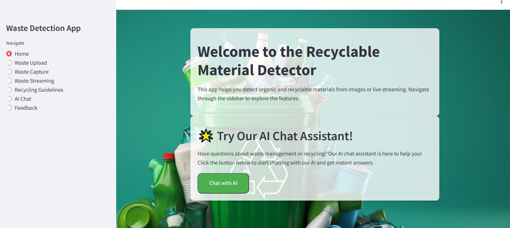
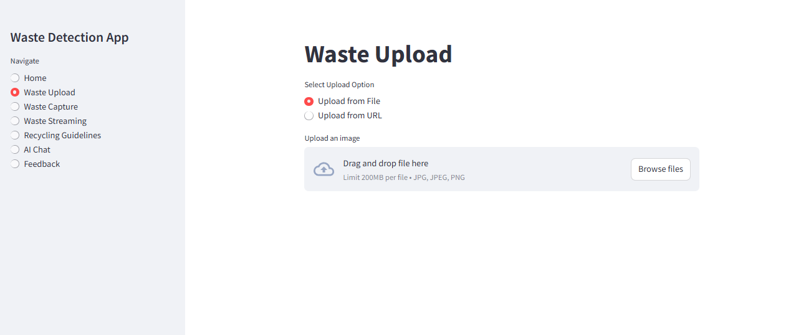
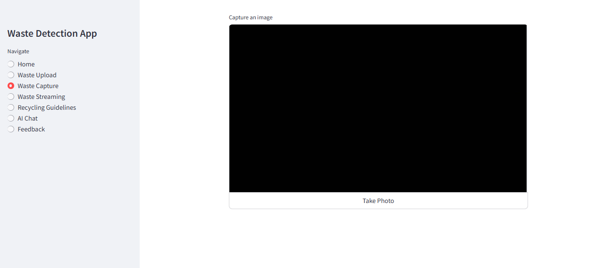
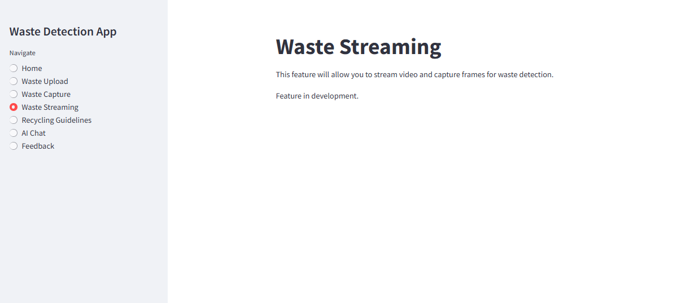
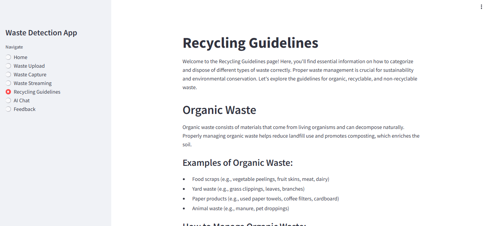
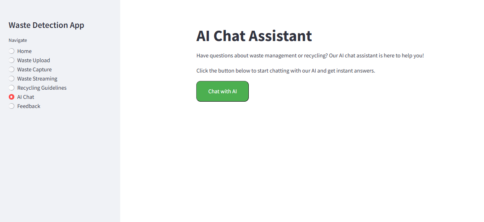
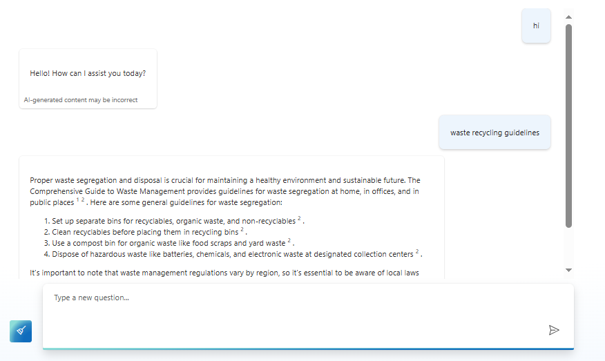
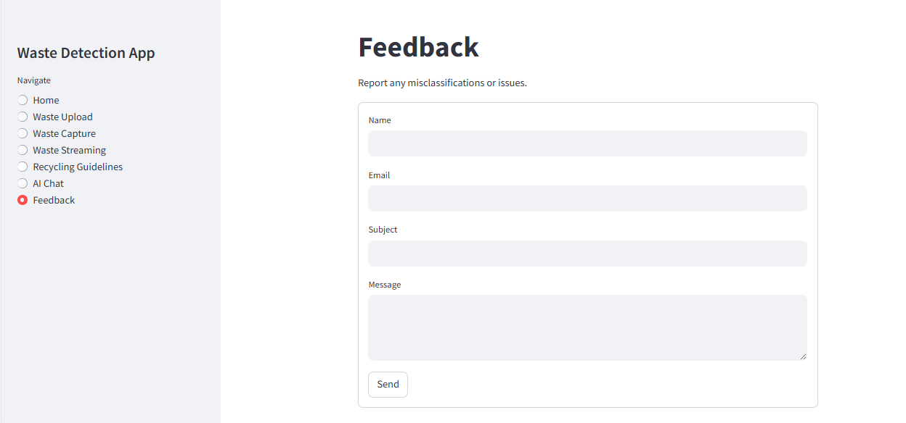

## **Application Overview**

### **Waste Detection App: Features Overview**

**1. Home**

*Caption*: "The Home screen provides a welcome and an overview of the app’s capabilities. Users can navigate to various sections of the app from this central hub."

---

**2. Waste Upload**

*Caption*: "The Waste Upload feature allows users to upload images of waste for classification. Users can select files from their device and submit them for processing."

---

**3. Waste Capture**

*Caption*: "The Waste Capture feature enables users to take real-time photos of waste using their device's camera. The captured images are then classified by the application."

---

**4. Waste Streaming**

*Caption*: "The Waste Streaming feature allows users to stream live video of waste for real-time classification. This feature is useful for continuous waste monitoring and immediate feedback."

---

**5. Recycling Guidelines**

*Caption*: "The Recycling Guidelines section provides users with comprehensive information on how to properly sort and recycle different types of waste. It includes tips and guidelines for effective recycling practices."

---

**6. AI Chat**

*Caption*: "The AI Chat feature offers real-time assistance and answers to questions related to waste management. Clicking this option redirects users to the Waste Chat web app for interactive support."

---

**7. Feedback**

*Caption*: "The Feedback section allows users to submit their opinions and experiences with the app. This feature is essential for collecting user insights and improving the application."

